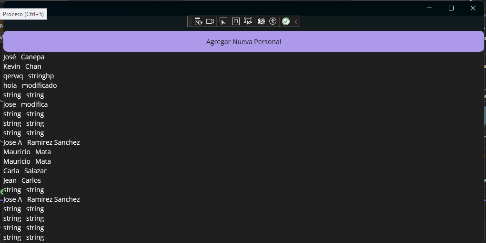
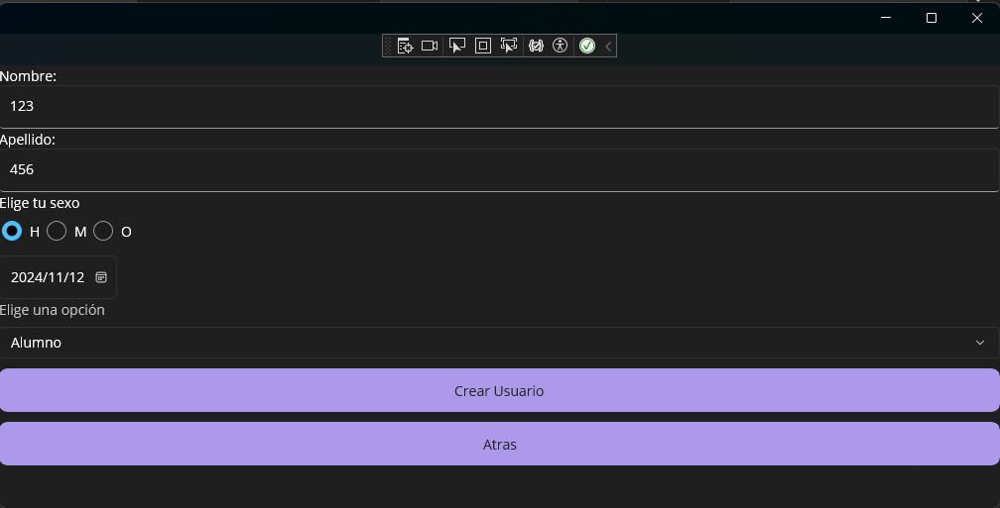
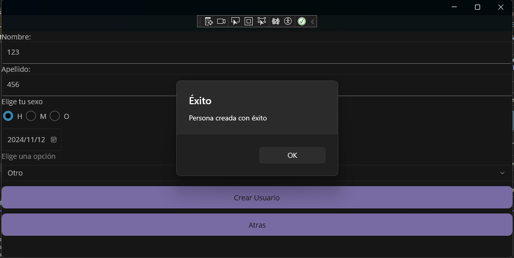

# **Sistema Escolar en MAUI**  

Este repositorio contiene un proyecto desarrollado en .NET MAUI que se comunica con la API [Escuela API](https://fi.jcaguilar.dev/docs/) utilizando **Data Bindings** y **peticiones HTTP**.

## **Vista de Personas**
La pantalla principal muestra una lista de todas las personas registradas en la API, obtenidas mediante una petición `GET` al endpoint:  
`https://fi.jcaguilar.dev/v1/escuela/persona`.  

Incluye un botón que permite navegar a la vista de registro de nuevas personas.

## **Formulario de Registro**
Esta pantalla permite al usuario registrar una nueva persona en la API.  
- Los datos ingresados en el formulario se formatean en un objeto JSON.
- La información se envía mediante una petición `POST` a la API para su almacenamiento.

---

## **Notificación de Éxito**
Al completar el registro exitosamente, el usuario recibe un **DisplayAlert** que confirma la operación.

